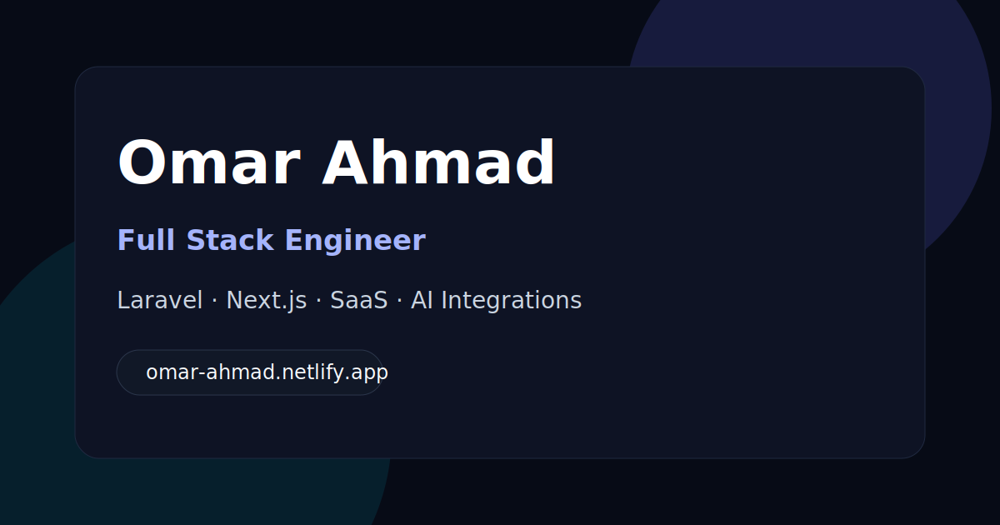

# Omar Ahmad — Portfolio

Modern bilingual developer portfolio built with **Next.js**, designed to preserve the original visual identity while improving maintainability, content management, SEO, and future scalability.

## Preview



> Personal portfolio for **Omar Ahmad** — Full Stack Engineer focused on Laravel, Next.js, SaaS systems, multilingual products, and practical AI integrations.

---

## Tech Stack

- **Next.js**
- **TypeScript**
- **CSS architecture based on the original design system**
- **Netlify** deployment
- **Resend** for contact email delivery

---

## Features

- Bilingual support (**Arabic / English**)
- Clean content-driven structure
- Easy editing for:
  - projects
  - skills
  - services
  - experience
  - site settings
- SEO-ready metadata
- `robots.ts` and `sitemap.ts`
- Working contact form with server-side email support
- Preserved original portfolio visual identity

---

## Project Structure

```bash
src/
├── app/
│   ├── [locale]/
│   ├── api/
│   ├── layout.tsx
│   ├── robots.ts
│   └── sitemap.ts
│
├── components/
│   └── portfolio/
│
├── content/
│   ├── experience.ts
│   ├── projects.ts
│   ├── services.ts
│   ├── site.ts
│   ├── skills.ts
│   └── social-links.ts
│
├── lib/
│   ├── content/
│   ├── i18n/
│   └── seo/
│
├── messages/
│   ├── ar.ts
│   └── en.ts
│
├── styles/
└── types/
```

---

## Content Management

The site is intentionally built so content can be updated without touching UI components.

### Update projects

Edit:

```bash
src/content/projects.ts
```

### Update skills

Edit:

```bash
src/content/skills.ts
```

### Update services

Edit:

```bash
src/content/services.ts
```

### Update experience

Edit:

```bash
src/content/experience.ts
```

### Update site settings

Edit:

```bash
src/content/site.ts
src/content/social-links.ts
```

### Update translations

Edit:

```bash
src/messages/en.ts
src/messages/ar.ts
```

> The goal is to keep **all user-facing text out of UI components** as much as possible.

---

## Local Development

Install dependencies:

```bash
pnpm install
```

Run development server:

```bash
pnpm dev
```

Open:

```bash
http://localhost:3000
```

---

## Contact Form

The contact form supports real email sending.

To enable it, create:

```bash
.env.local
```

And add:

```env
RESEND_API_KEY=your_resend_api_key
CONTACT_FROM_EMAIL=your_verified_sender@example.com
CONTACT_TO_EMAIL=your_email@example.com
```

### Notes

- Without these environment variables, real email delivery will not work.
- Make sure `CONTACT_FROM_EMAIL` is a sender verified in **Resend**.

---

## SEO

SEO is configured through:

- `src/lib/seo/`
- `src/app/robots.ts`
- `src/app/sitemap.ts`
- `src/content/site.ts`

Includes support for:
- metadata
- Open Graph
- sitemap
- robots
- Google site verification

---

## Deployment

### Netlify

This project can be deployed directly to **Netlify** from GitHub.

Recommended flow:

1. Push project to GitHub
2. Connect repository to Netlify
3. Add required environment variables
4. Deploy

### Required Environment Variables on Netlify

```env
RESEND_API_KEY=your_resend_api_key
CONTACT_FROM_EMAIL=your_verified_sender@example.com
CONTACT_TO_EMAIL=your_email@example.com
```

---

## Updating Existing Netlify Project

Even if the previous version of the site was built with plain:

- HTML
- CSS
- JavaScript

You can still update the same Git repository to this new **Next.js** version.

Netlify will rebuild the project based on the new framework setup once the repository is updated.

> Just make sure the site on Netlify is using the new project configuration and environment variables.

---

## Assets

### Open Graph image

Used here:

```bash
public/og-image.svg
```

You can replace it with:
- another SVG
- PNG
- branded cover image

### Hero image

You can replace the hero image from:

```bash
public/images/omar-ahmad-hero.png
```

Recommended:
- transparent PNG
- clean portrait
- high resolution

---

## Future Improvements

Possible future upgrades:

- lightweight admin panel for content editing
- CMS integration
- blog / case studies
- project details pages
- testimonials
- analytics dashboard

---

## Author

**Omar Ahmad**  
Full Stack Engineer  
Laravel • Next.js • SaaS • AI Integrations

- LinkedIn: [omar-mahmoud-ahmad](https://www.linkedin.com/in/omar-mahmoud-ahmad)
- X: [@omar_m_ahmad](https://x.com/omar_m_ahmad)

---

## License

This project is for personal portfolio use unless otherwise stated.
